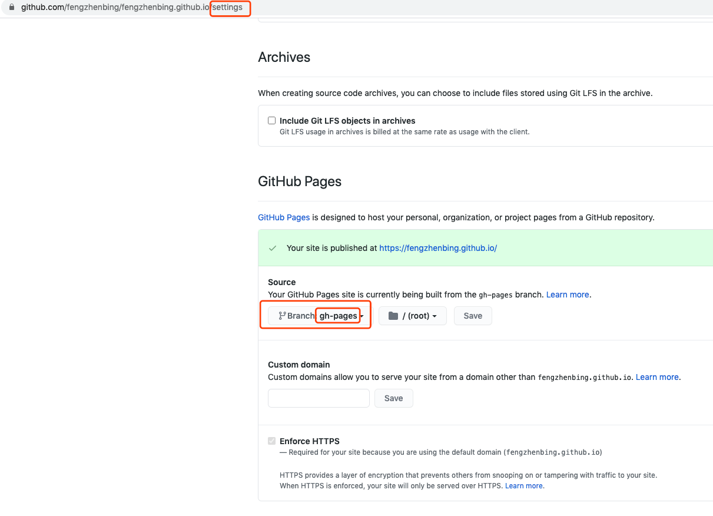
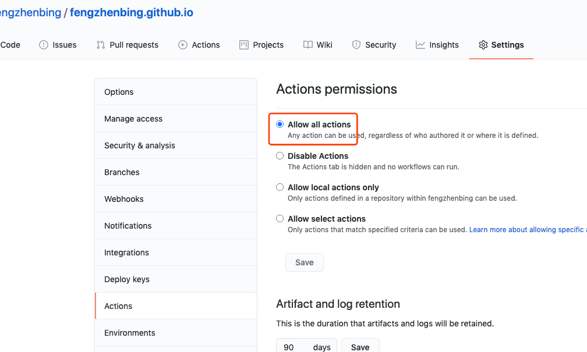

通过Hugo搭建静态博客网站，再通过github pages部署运行
### Hugo介绍
- Hugo是一种用Go语言编写的快速，现代的静态网站生成器，旨在让网站创建再次变得有趣。
- 性能高，安全性和易用性是主要特点
- 拥有超快的速度，强大的内容管理和强大的模板语言，使其非常适合各种静态网站。
### Hugo安装
```
# mac上安装
brew install hugo
# windows可通过Chocolatey上安装
choco install hugo -confirm
# 版本验证
hugo version
```
### hugo主题
- [查找你喜欢的主题](https://themes.gohugo.io/)
- 在此我选择的主题为toha [详情](https://toha-guides.netlify.app/posts/getting-started/)

### 初始化网站模板
```
# 首先在github下创建xxx.github.io的仓库
git clone https://github.com/fengzhenbing/fengzhenbing.github.io.git
cd ./fengzhenbing.github.io

# 初始化模板
hugo new site ./ -f=yaml --force

#添加hugo-toha主题
git submodule add https://github.com/hugo-toha/toha.git themes/toha

#本地运行
hugo server -t toha -w
```

### 修改配置
参考themes/toha/exampleSite，配置网站根目录下的config.yml文件，配置网站各个模块
```yaml
baseURL: https://fengzhenbing.github.io/

languageCode: en-us
defaultContentLanguage: cn
title: "Feng Zhenbing's Blog"
theme: "toha"

# Manage languages
# For any more details, you can check the official documentation: https://gohugo.io/content-management/multilingual/
languages:
  cn:
    languageName: 中文
    weight: 1
#  en:
#    languageName: English
#    weight: 2

# Control TOC depth
markup:
  tableOfContents:
    startLevel: 2
    endLevel: 6
    ordered: false

# Enable global emoji support
enableEmoji: true

# Site parameters
params:
  # GitHub repo URL of your site
  gitRepo: https://github.com/fengzhenbing/fengzhenbing.github.io
  gitBranch: master

  # specify whether you want to write some blog posts or not
  enableBlogPost: true

  # specify whether you want to show Table of Contents in reading page
  enableTOC: true

  # Provide newsletter configuration. This feature hasn't been implemented yet.
  # Currently, you can just hide it from the footer.
  newsletter:
    enable: true
```
- 至此浏览器中查看[http://localhost:1313/](http://localhost:1313/) 可看到大致的博客网站,
- 更多细节查看[https://toha-guides.netlify.app/posts/getting-started/prepare-site/](https://toha-guides.netlify.app/posts/getting-started/prepare-site/)

### Github Pages 中部署
- 创建分支
```
#github 创建部署文件的分支
git branch -b gh-pages
git push
```
- github中setting中将部署分支设为gh-pages分支
  
  
- 开启github actions

  
- 编写github actions的部署文件
```yaml
# 进入网站根目录，创建./github/workflows目录
mkdir ./github/workflows
cd ./github/workflows
vim deploy-site.yaml
```
deploy-site.yaml
```yaml
name: Deploy to Github Pages

# run when a commit or pr is pushed to "master" branch
on:
  pull_request:
  push:
    branches:
      - master

jobs:
  deploy:
    runs-on: ubuntu-18.04
    steps:
      # checkout to the commit that has been pushed
      - uses: actions/checkout@v2
        with:
          submodules: true  # Fetch Hugo themes (true OR recursive)
          fetch-depth: 0    # Fetch all history for .GitInfo and .Lastmod

      # install Hugo
      - name: Setup Hugo
        uses: peaceiris/actions-hugo@v2
        with:
          hugo-version: '0.77.0'
          extended: true

      # build website
      - name: Build
        run: hugo --minify

      # push the generated content into the `main` (former `master`) branch.
      - name: Deploy
        uses: peaceiris/actions-gh-pages@v3
        if: github.event_name == 'push' && github.ref == 'refs/heads/master'
        with:
          github_token: ${{ secrets.GITHUB_TOKEN }}
          publish_branch: gh-pages # if your main branch is `master` use that here.
          publish_dir: ./public
```

提交后，每次改动master分支，github action会运行以上任务，自动打包文件到gh-pages分支，并部署
